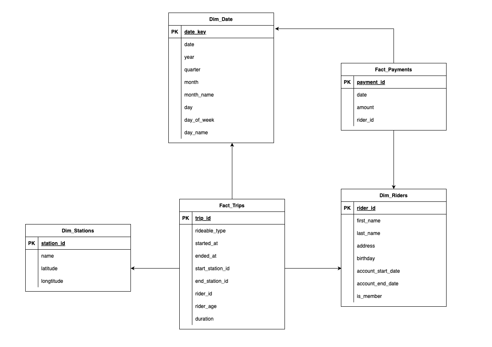

# Divvy Bikeshare Data Lake Solution

## Project Overview

In this project, we are tasked with building a data lake solution for the Divvy bikeshare program, based in Chicago, Illinois. Divvy is a popular bike-sharing program where users can unlock bikes at various stations around the city using a pass or a mobile application. The goal of this project is to create a data lake solution in **Azure Databricks** with a **Lakehouse architecture** to analyze and visualize the data for various business outcomes.

The data provided by Divvy is anonymized and includes bike trip data, which has been augmented with fake rider and account profiles, as well as fake payment data to create a more complete dataset. The dataset consists of several tables, including:

- **Rider**: Information about the riders.
- **Account**: Account-related details.
- **Payment**: Payment data for each ride.
- **Trip**: Information on each bike trip taken.
- **Station**: Information about the bike stations.

### Business Outcomes to Analyze:

The goal is to design a solution that will analyze the following business outcomes:

1. **Time Spent per Ride:**
   - Time based on the date and time factors such as the day of the week and time of day.
   - Time based on which station is the starting and/or ending station.
   - Time based on the age of the rider at the time of the ride.
   - Time based on whether the rider is a member or a casual rider.

2. **Money Spent:**
   - Total money spent per month, quarter, or year.
   - Money spent per member, based on the age of the rider at account start.

3. **Extra Credit:**
   - Money spent per member based on how many rides the rider averages per month.
   - Money spent per member based on how many minutes the rider spends on a bike per month.

---

## Solution Architecture

This project leverages **Azure Databricks** with **Delta Lake** to implement a **Lakehouse Architecture**. The solution involves the following steps:

### 1. **Designing a Star Schema**

A star schema is designed to structure the data efficiently for querying and analysis. This will include fact and dimension tables based on the Divvy dataset.

### 2. **Data Ingestion into Delta Lake (Bronze Layer)**

- The raw Divvy dataset is ingested into **Azure Databricks**.
- The data is stored in **Delta Lake's Bronze Layer**. This layer consists of untransformed, raw data that can be later processed and cleaned.

### 3. **Data Transformation (Silver Layer)**

- The data is cleaned and transformed in the **Silver Layer** of the data lake.
- Data is joined across tables, and transformations are applied to ensure consistency and quality for further analysis.

### 4. **Gold Data Store Creation**

- The transformed data is structured into a **Gold Layer**, where it is ready for analysis.
- The data is organized into Delta Lake tables based on the star schema, making it optimized for high-performance querying.

### 5. **Business Logic Implementation**

Using the transformed data, we will create business logic to calculate key metrics such as ride duration, spending trends, and more.

---

## Steps to Run the Project

1. **Setup Azure Databricks Environment:**
   - Ensure you have an **Azure Databricks** workspace.
   - Create a **Delta Lake** environment within Azure Databricks.

2. **Ingest Data into Bronze Layer:**
   - Import the raw Divvy dataset into Databricks.
   - Use **Delta Lake** format to store the data.

3. **Transform Data into Silver Layer:**
   - Cleanse and transform the data to ensure it's ready for analysis.
   - Join the relevant tables and ensure data quality.

4. **Create Gold Data Store:**
   - Build the final data models using the **star schema**.
   - Store the results in Delta Lake tables optimized for analysis.

5. **Run Business Logic Queries:**
   - Implement queries to calculate ride time, spending behavior, and other metrics.
   - Create visualizations based on the analysis.

---

## Extra Credit

- Implement additional analyses to calculate:
  - Average money spent per member based on their monthly rides and ride durations.
  
---

## Technologies Used

- **Azure Databricks**: Platform for building the data lake and lakehouse architecture.
- **Delta Lake**: For managing large-scale data lakes with ACID transactions.
- **SQL**: For querying and transforming the data.
- **Python**: For additional data transformations and automation.
- **Power BI / Tableau**: For data visualization (if applicable).

---

## Future Enhancements

- **Real-time Data Ingestion**: Implement real-time data ingestion for live analysis.
- **Advanced Analytics**: Explore predictive analytics models to predict future rider behavior.

---

## Conclusion

By building this data lake solution, we enable comprehensive analysis of Divvy's bikeshare data, providing valuable insights into rider behavior, station performance, and financial patterns. This project demonstrates how to effectively structure and process large datasets using modern cloud technologies and architectures.

