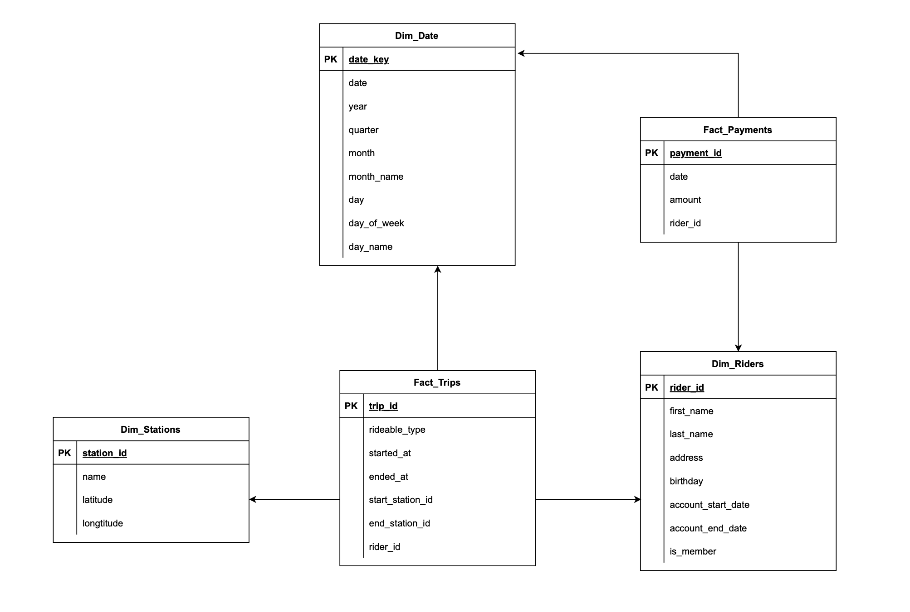
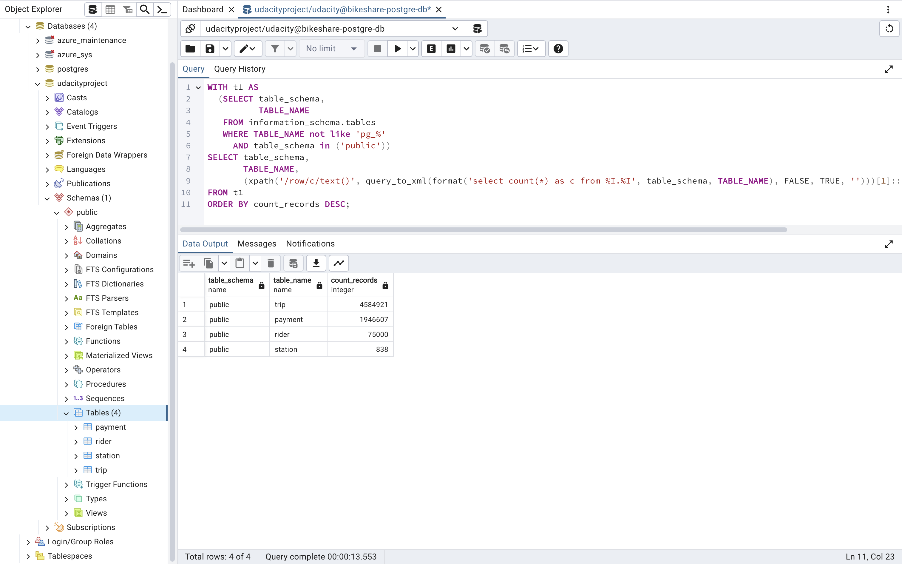
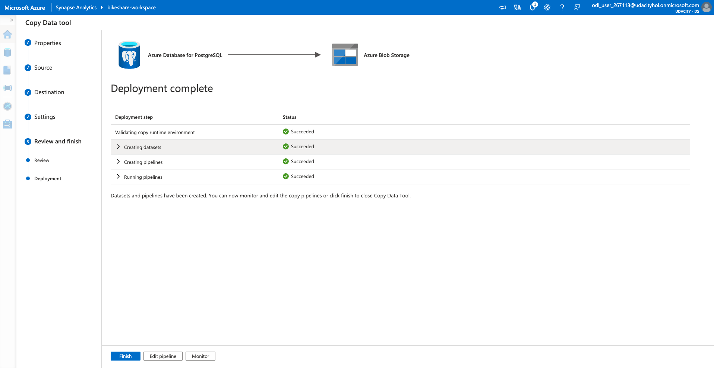
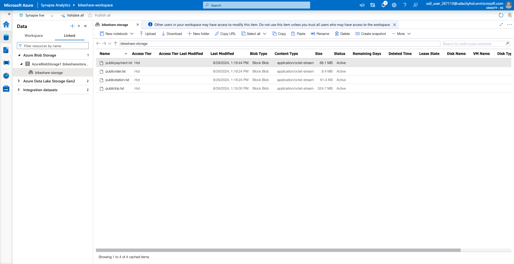
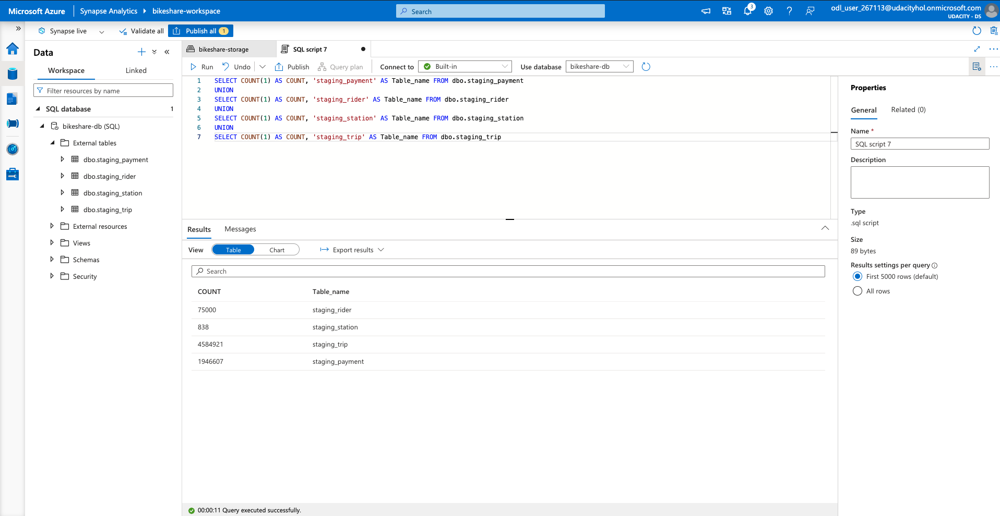
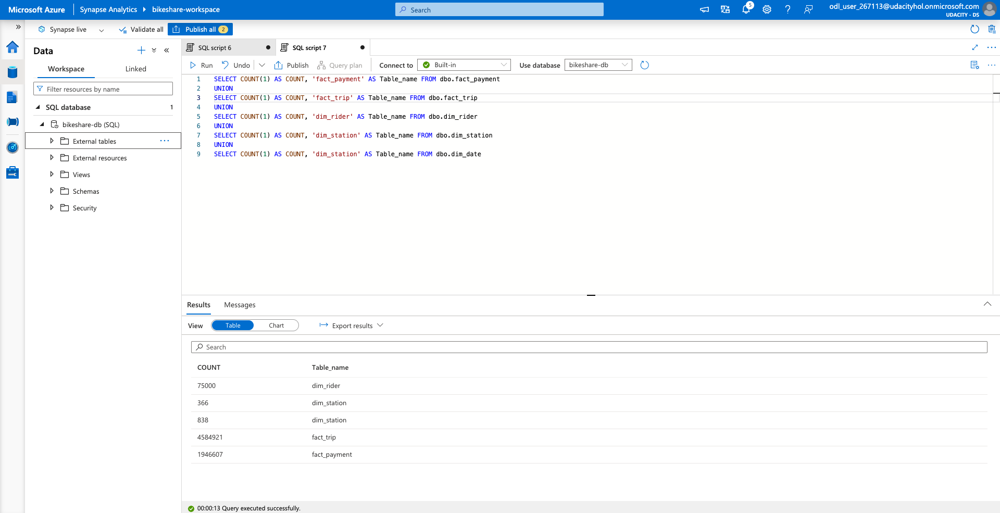

# Building an Azure Data Warehouse for Bike Share Data Analytics

## Project Overview

This project focuses on building a data warehouse solution using Azure Synapse Analytics to analyze bike-sharing data from Divvy, a bike-sharing program in Chicago, Illinois, USA. Divvy allows riders to unlock bikes via a mobile app or at kiosks, and the anonymized trip data is publicly available for analysis. To enrich this dataset, we have created synthetic rider profiles, accounts, and payment data.

### Objectives

The goal is to design and implement a star schema in Azure Synapse Analytics for analyzing various aspects of bike usage and spending:

1. **Time Analysis**:
   - Analyze ride duration based on day of the week, time of day, starting/ending station, rider age, and membership type (member or casual).

2. **Spending Analysis**:
   - Analyze total spending per month, quarter, and year, and by member age at account start.

3. **Extra Credit**:
   - Analyze spending per member based on average monthly rides and minutes spent on a bike.

## Project Requirements

### Task 1: Create Your Azure Resources

- Create an Azure Database for PostgreSQL
- Create an Azure Synapse Workspace
- Use the Built-In Serverless SQL Pool

### Task 2: Design a Star Schema
 
1. **Review Provided Relational Schema**:
   - Use the provided relational schema from PostgreSQL.

2. **Design a Star Schema**:
   - Create fact and dimension tables based on the business outcomes listed.

### Task 3: Create the Data in PostgreSQL
Prepare the PostgreSQL database with the provided data using a Python script. This setup simulates the production environment where data is initially stored and managed.

### Task 4: Extract the Data from PostgreSQL
Extract the data from PostgreSQL and transfer it to Azure Blob Storage. This process prepares the data for loading into Azure Synapse by converting it into a format suitable for further processing.

### Task 5: Load Data into External Tables
Load the extracted data from Azure Blob Storage into external staging tables within Azure Synapse. This step integrates the data into the data warehouse environment, making it ready for transformation and analysis.

### Task 6: Transform Data to the Star Schema

Transform the data from staging tables into the final star schema using SQL scripts. Utilize the CETAS (Create External Table As Select) function to handle the transformation and export results to the storage account.

